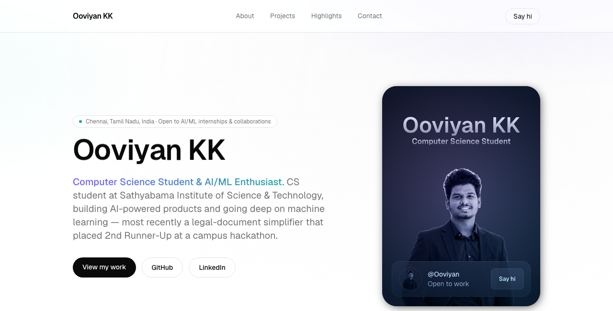

# Ooviyan KK — Portfolio

Personal portfolio site built with Next.js and Tailwind CSS.



## Stack

- [Next.js](https://nextjs.org) (App Router) + React + TypeScript
- Tailwind CSS + [shadcn/ui](https://ui.shadcn.com)
- Radix UI primitives, GSAP, Motion, Embla Carousel

## Getting Started

```bash
npm install
npm run dev
```

Open [http://localhost:3000](http://localhost:3000) to view it locally.

## Structure

- `src/app` — routes and global layout
- `src/components` — page sections (Hero, About, Projects, Highlights, Contact, Footer)
- `src/lib/data.ts` — profile, skills, and project content
